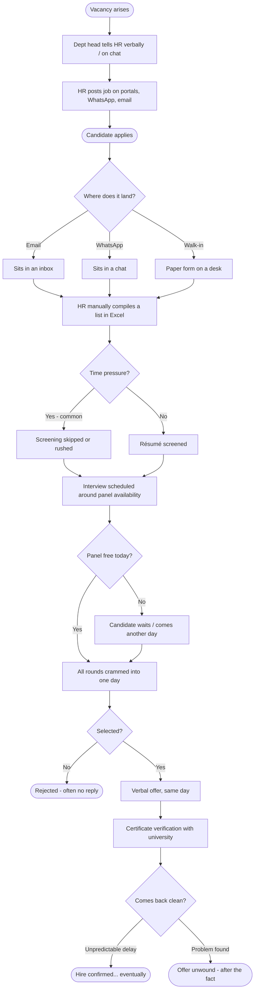
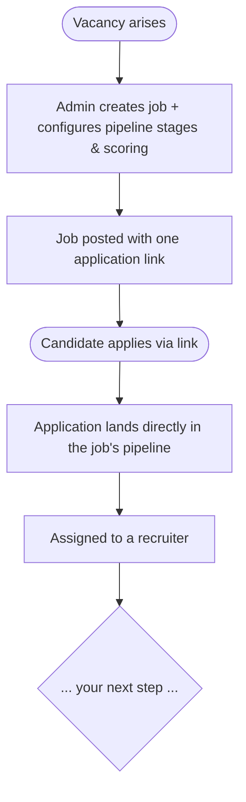

# Process Flows — Banyan ATS

> **Status: TEMPLATE — as-is worked as an example; to-be to be drafted by Dhilip.**
> Guidance blockquotes are retained for learning; delete them as sections firm up.
>
> **The idea:** draw hiring as a sequence of steps TWICE — once as it happens today
> (*as-is*, the problem) and once as it happens with Banyan (*to-be*, the solution).
> The DIFFERENCE between the two maps is the product's value. Diagrams are written in
> Mermaid (text that GitHub renders into a picture) so they live in the repo and diff
> like code.

---

## Notation legend

> The shared visual vocabulary. In Mermaid:

- `([ text ])` → **rounded box** = a start or end point
- `[ text ]` → **rectangle** = an action / step
- `{ text }` → **diamond** = a decision (branches labelled `-->|Yes|`)
- `-->` → **arrow** = flow direction
- `subgraph` → a **swimlane** grouping the steps owned by one actor

> `flowchart TD` = top-down layout; `flowchart LR` = left-to-right. Use TD for long
> flows (scrolls vertically), LR for short ones.

---

## Part A — As-is: hiring today, WITHOUT Banyan  *(worked example — study the syntax)*

> This is the problem from `01-problem-statement.md`, drawn. Notice how the diagram
> makes the pain visible: scattered entry points, a manual compile step, stages that
> get skipped, and verification happening AFTER the offer.

> **Read the pain in the picture:** three entry points that never meet until a manual
> Excel step (D1); a decision (E1) whose common branch SKIPS screening; verification
> (K1) happening *after* the offer, so problems surface too late. Every one of these
> is something the to-be flow should fix.

---

## Part B — To-be: hiring WITH Banyan  *(your turn to design)*

> Now draw the improved flow. Don't just "add software" to the old steps — rethink
> them. Prompts drawn from your personas and problem statement:
>
> - Where does Arthi's work now happen (configuring the job + pipeline UP FRONT)?
> - Do the three entry points still exist, or does one application link replace them?
> - Where does screening sit now so it can't be skipped?
> - Where does verification move to, so problems surface BEFORE the offer?
> - What does the candidate (Cathy) see instead of silence?
>
> A scaffold to get you started — replace the placeholders and extend it. Keep the
> `mermaid` fence so it renders.

> Build out T6 onward. Aim to show: the pipeline stages as steps, scoring at stages,
> verification positioned BEFORE the offer, and the candidate kept informed. It's fine
> to be rough — we'll refine in review.

---

## Part C — What changed (the delta = the value)

> Fill LAST, after both diagrams exist. One line per meaningful improvement, each
> tracing to a step that changed between as-is and to-be. This section turns two
> pictures into an argument.

- **Scattered entry points → one pipeline:** *...*
- **Manual Excel compile → automatic intake:** *...*
- **Skippable screening → a stage that can't be bypassed:** *...*
- **Verification after offer → verification before offer:** *...*
- **Candidate silence → candidate visibility:** *...*
- *(add any others your to-be flow reveals)*
