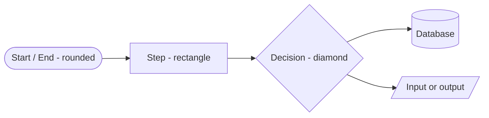
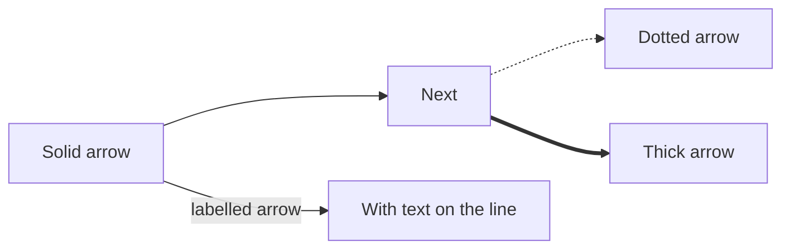
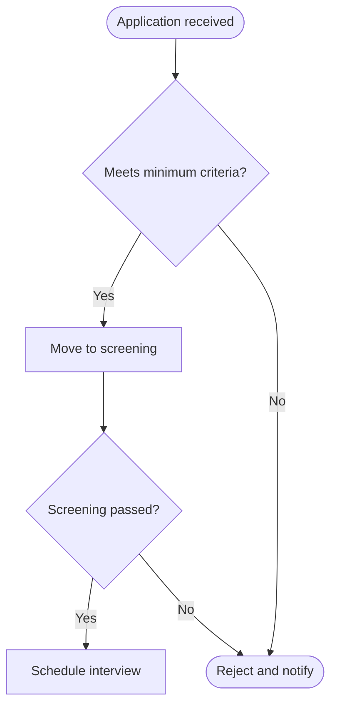
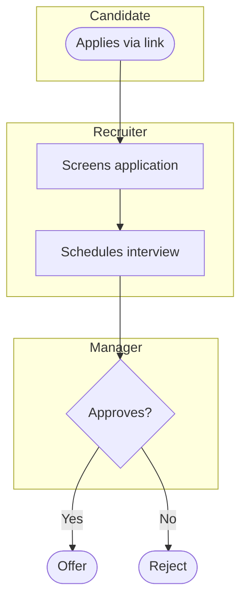
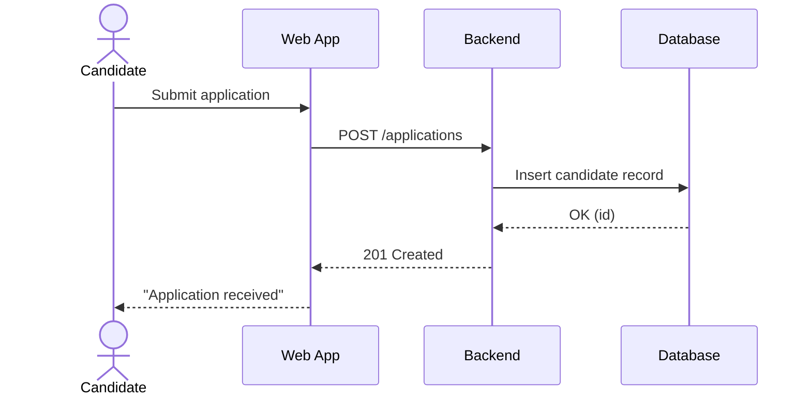

# Mermaid Guide

A practical reference for writing diagrams as text. Focused on what this project
actually needs (mostly flowcharts, with a look at sequence diagrams for later).

**Open this file on GitHub** to see every example rendered right below its code — the
page demonstrates itself. Locally, use the VS Code extension *"Markdown Preview Mermaid
Support"* and open the Markdown preview.

---

## The 3 rules that make a diagram render

Every Mermaid diagram needs all three, or it shows as plain text (or errors):

1. **Wrap it in a fenced code block tagged `mermaid`.** The opening line is three
   backticks immediately followed by the word `mermaid`. That tag is what tells GitHub
   "draw this," not "print this."
2. **First line inside declares the diagram type** — e.g. `flowchart TD`.
3. **One statement per line.** Mermaid reads line by line.

The raw text of a flowchart block looks like this:

    ```mermaid
    flowchart TD
        A --> B
    ```

(Indentation inside is optional but keeps it readable.)

---

## Flowcharts

The workhorse for process flows. First line is `flowchart <direction>`.

### Direction

- `TD` or `TB` — top-down (best for long flows; scrolls vertically)
- `LR` — left-to-right (best for short flows)
- `RL`, `BT` — right-to-left, bottom-to-top (rarely needed)

### Node shapes (the visual vocabulary)



| Syntax | Shape | Use for |
|--------|-------|---------|
| `A([text])` | rounded box | start / end points |
| `B[text]` | rectangle | an action or step |
| `C{text}` | diamond | a decision |
| `D[(text)]` | cylinder | a database / data store |
| `E[/text/]` | parallelogram | input / output |

> A node's **id** (the `A`, `B`, `C`) is an invisible handle you reuse to point arrows
> at it. Its **label** (the text in brackets) is what shows. Define the label once;
> after that, just use the id.

### Arrows (links)



- `-->` solid arrow (the default)
- `-.->` dotted arrow (good for "optional" or "async" steps)
- `==>` thick arrow (good for emphasising a main path)
- `-->|text|` puts a label on the arrow — essential for decision branches

### Decisions with branches



> Note `E -->|No| D` reuses node `D` — several branches can point at the same node.
> That's how you show "all roads lead to rejection" without drawing it twice.

---

## Swimlanes (who does what) with `subgraph`

Group steps by the actor who owns them. Each `subgraph ... end` is one lane.



> Swimlanes make it obvious when work bounces between people — every arrow that crosses
> a lane boundary is a hand-off, and hand-offs are where delays and dropped balls live.

---

## Sequence diagrams (for later — interactions over time)

You won't need these for process flows, but they're the standard way to show how parts
of a *system* talk to each other (e.g. browser → backend → database) — useful when we
reach API design. First line is `sequenceDiagram`.



- `->>` solid arrow = a call / request
- `-->>` dashed arrow = a response / return
- `participant X as Label` gives a short id and a readable label

---

## Common gotchas

- **Rendered as plain text?** You dropped the ` ```mermaid ` tag or the diagram-type
  first line. (This is the #1 first-timer mistake.)
- **Everything on one line?** Split it — one statement per line.
- **Parentheses/special characters inside a label break it?** Wrap the label text in
  double quotes: `A["Offer (verbal)"]`.
- **Two nodes you meant to connect stay separate?** Check the ids match exactly —
  `Node1` and `node1` are different; Mermaid ids are case-sensitive.
- **Diagram too wide to read?** Switch `LR` to `TD`, or break one big flow into
  smaller ones.

---

## Where Mermaid renders

- **GitHub** — automatically, in the browser, anywhere a `mermaid` block appears in a
  `.md` file.
- **VS Code** — with the *"Markdown Preview Mermaid Support"* extension, in the
  Markdown preview pane.
- **Live editor / sandbox** — <https://mermaid.live> lets you experiment and see errors
  instantly; handy while learning the syntax.

For the full specification (many more diagram types — Gantt, ER, state, class): the
official docs at <https://mermaid.js.org>.
